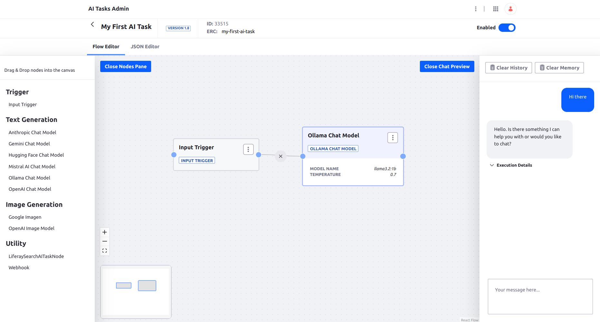

# AI Tasks Quick Start

In this tutorial we will:
1. Set up a local Ollama server
1. Create an AI Task from scratch
1. Add a test chatbot on portal home page

Before moving forward, make to sure to have portal running and all the AI Tasks modules deployed.

See more examples in the [samples folder](./samples).

## 1. Set Up a Local Ollama Server

1. Go to https://ollama.com/download
1. Download the package for your OS
1. Follow the instructions and install
1. Run the `ollama3.2:1b` (in Linux shell: `ollama run ollama3.2:1b`)

## 2. Create an AI Task

1. Go to Application -> AI Tasks -> AI Tasks Admin 
1. Click the plus button and create a new AI Task
1. Enter name and external reference code `my-first-ai-task`
1. In the workflow editor, click the `Open Nodes Pane`
1. Drag `Input Trigger` on the canvas
1. Drag `Ollama Chat Model` on the canvas
1. Connect the `Input Trigger` to the `Ollama Chat Model`
1. Click the `Open Chat Preview`
1. Test the task by entering `Hello there`and hit `Enter`

If everything was set up correctly, let's move to setting up a test chatbot

## 3. Add a Test Chatbot

1. Go to the portal home page
1. Open the page edit view
1. In the `Fragments and Widgets` search bar, enter `chat`
1. Drag and drop the `Ai Tasks Chat` on the page and publish the page. You should see the chatbot on the bottom right corner of the page now
1. Click on the bot icon
1. When it asks for the external reference code, answer with `my-first-ai-task` 
1. Try chatting

Play with the task by for example changing the system message in the `Ollama Chat Model` node configuration. You can access the configuration in the 3 vertical dots button in the top right corner of the node.

