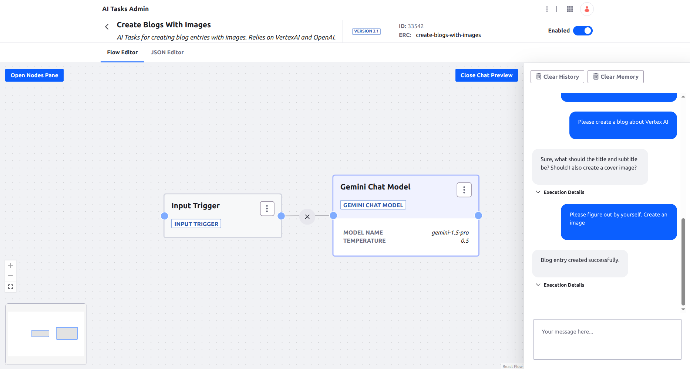
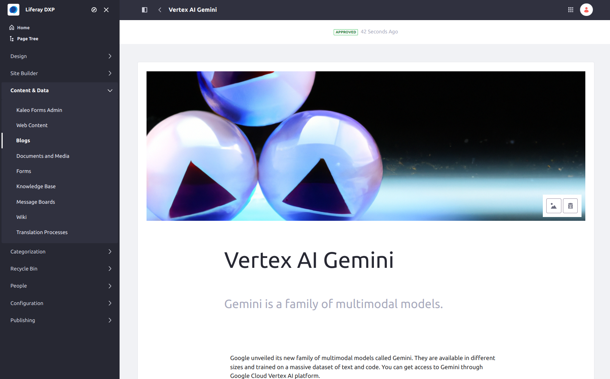

# Create Blogs With Images

An AI Task creating a Blogs Entry with image.





## Requirements

* Vertex AI Gemini model access set up
* OpenAI API key


## Installation

1. Authenticate to Vertex AI with `gcloud auth login`
1. Set up your GLCOUD_PROJECT_NAME environment 
1. Set up your OPENAI_API_KEY environment variable
1. Import the [AI Task](./create-blogs-with-images.json)
1. Test in the chat preview


## Usage through REST API

```
curl -X 'POST' \
  'http://localhost:8080/o/ai-tasks/v1.0/generate/create-blogs-with-images' \
  -H 'accept: application/json' \
  -H 'Content-Type: application/json' \
  -u 'test@liferay.com:test' \
  -d '{
  "input": {"text": "Create a blog post about Liferay"}
}'
```