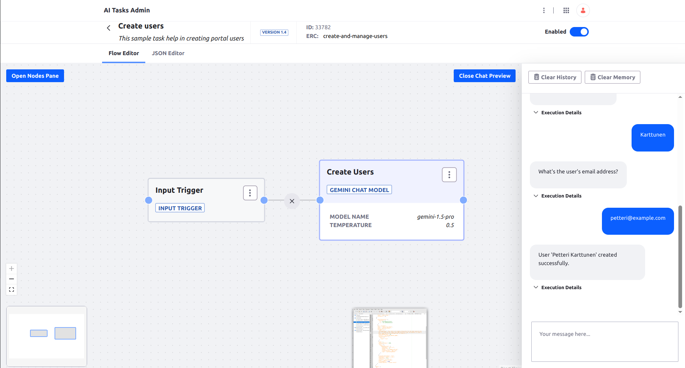

# Create Users

Creates portal users.



## Requirements

* Vertex AI Gemini model access set up

## Installation

1. Authenticate to Vertex AI with `gcloud auth login`
1. Set up your GLCOUD_PROJECT_NAME environment 
1. Import the [AI Task](./create-users.json)
1. Test in the chat preview. Start for example with: _I'd like to create a new user._


## Usage through REST API

```
curl -X 'POST' \
  'http://localhost:8080/o/ai-tasks/v1.0/generate/create-users' \
  -H 'accept: application/json' \
  -H 'Content-Type: application/json' 
  -u 'test@liferay.com:test' \
  -d '{
  "input": {"text": "Create a new user"}
}'
```
