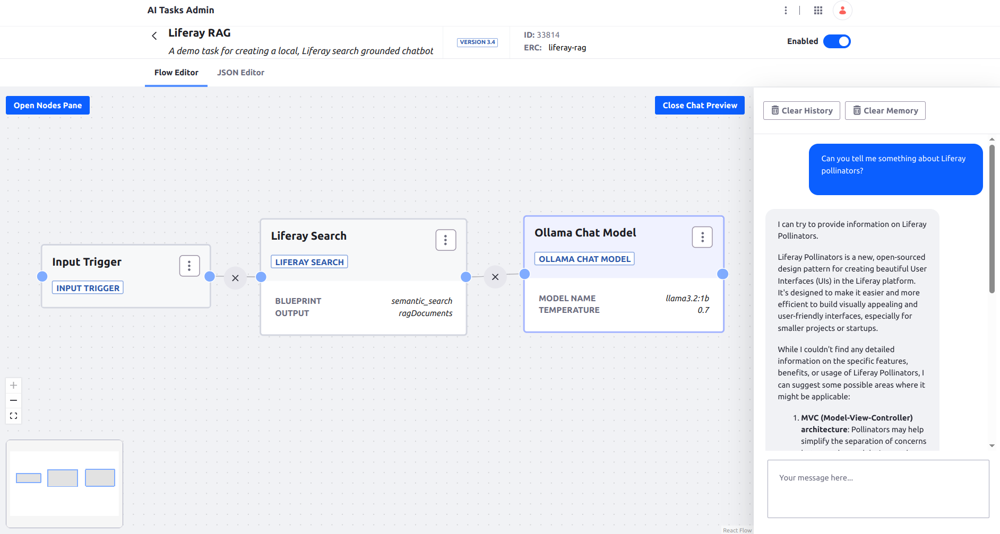

# Liferay RAG

AI Task for creating a Liferay search grounded chatbot.



## Requirements

* Local Ollama. See [installation instructions](https://ollama.com/)

## Installation

1. Run the llama3.2:1b model in Ollama
1. Import the [AI Task](./liferay-rag.json)
1. Create some local test content 
1. Test in the chat preview whether the bot return information about the local contents

**Optional Steps:**

An AI Task can ground to standard search or to Search Blueprint driven search. To make the task to ground to semantic search:


1. [Setup Liferay semantic search](https://learn.liferay.com/web/guest/w/dxp/using-search/liferay-enterprise-search/search-experiences/semantic-search)
1. Create a Blueprint for semantic search with external reference code `semantic_search`


## Usage through REST API

```
curl -X 'POST' \
  'http://localhost:8080/o/ai-tasks/v1.0/generate/liferay-rag' \
  -H 'accept: application/json' \
  -H 'Content-Type: application/json' 
  -u 'test@liferay.com:test' \
  -d '{
  "input": {"text": "Tell me about Liferay Clay"}
}'
```