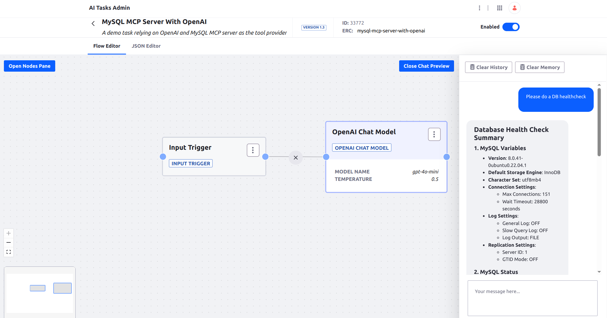

# MySQL MCP Server With OpenAI

A task using OpenAI chat model and relying on MySQL MCP server as the tool provider. Allows to ask questions about the configured MySQL database, like about the Liferay portal database.

## Requirements

* Node.js v18 or higher
* MySQL 5.7 or higher
* MySQL user with appropriate permissions for the operations you need
* [MCP MySQL server](https://github.com/benborla/mcp-server-mysql) setup and running
* OpenAI API account set up

## Installation

1. Set up the [MCP MySQL server](https://github.com/benborla/mcp-server-mysql). See the instructions on the project page.
1. Set up your OPENAI_API_KEY environment variable. For IntelliJ see [this](https://www.jetbrains.com/help/objc/add-environment-variables-and-program-arguments.html)
1. Import the [AI Task](./mysql-mcp-server-with-openai.json)
1. Configure the credentials and other properties in the AI Task
1. Test with the AI Tasks Admin preview

