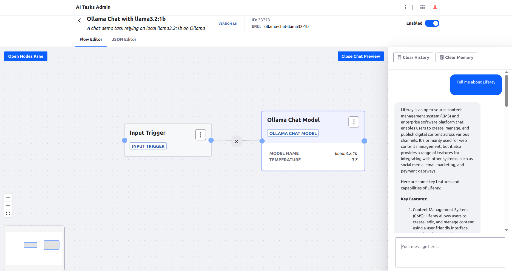

# Ollama Chat

A simple AI Task task using local Ollama with llama3.2:1b chat model.




## Requirements

* Local Ollama. See [installation instructions](https://ollama.com/)

## Installation

1. Run the llama3.2:1b model in Ollama
1. Import the [AI Task](./ollama-chat-with-llama32-1b.json)
1. Test in the chat preview


## Usage through REST API

```
curl -X 'POST' \
  'http://localhost:8080/o/ai-tasks/v1.0/generate/ollama-chat-llama32-1b' \
  -H 'accept: application/json' \
  -H 'Content-Type: application/json' \
  -u 'test@liferay.com:test' \
  -d '{
  "input": {"text": "Please tell me about Liferay"}
}'
```