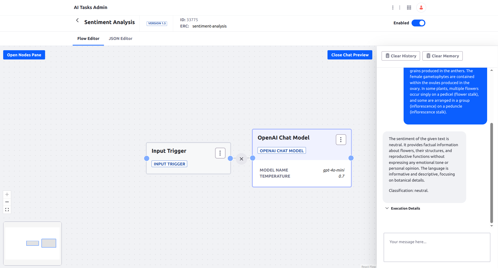

# OpenAI Chat

A simple AI Task task using OpenAI chat model.




## Requirements

* OpenAI API account set up

## Installation

1. Set up your OPENAI_API_KEY environment variable. For IntelliJ see [this](https://www.jetbrains.com/help/objc/add-environment-variables-and-program-arguments.html)
1. Import the [AI Task](./openai-chat.json)
1. Test in the chat preview


## Usage through REST API

```
curl -X 'POST' \
  'http://localhost:8080/o/ai-tasks/v1.0/generate/sentiment-analysis' \
  -H 'accept: application/json' \
  -H 'Content-Type: application/json' \
  -u 'test@liferay.com:test' \
  -d '{
  "input": {"text": "Please tell me about Liferay"}
}'
```