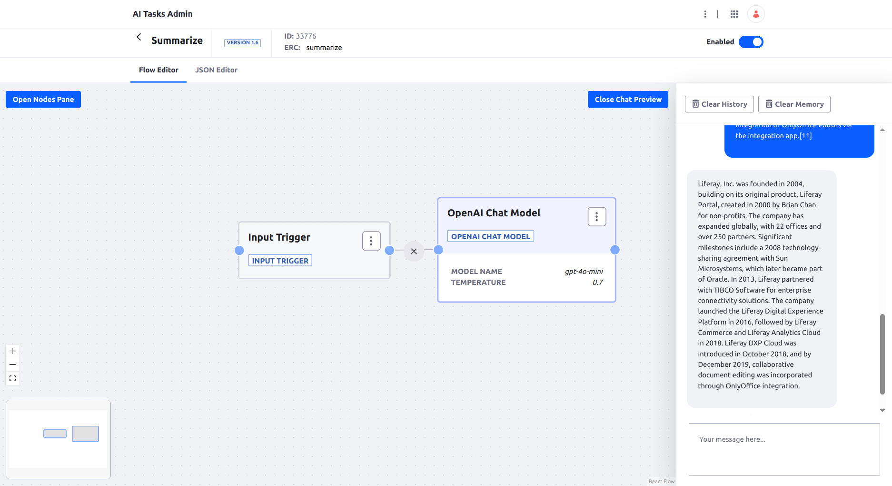

# Summarize

An AI Task summarizing the given text.




## Requirements

* OpenAI API account set up

## Installation

1. Set up OPENAI_API_KEY environment variable
1. Import the [AI Task](./summarize.json)
1. Test in the chat preview


## Usage Example through REST API

```
curl -X 'POST' \
  'http://localhost:8080/o/ai-tasks/v1.0/generate/summarize' \
  -H 'accept: application/json' \
  -H 'Content-Type: application/json' \
  -u 'test@liferay.com:test' \
  -d '{
  "input": {"text": "Hello world"}
}'
```